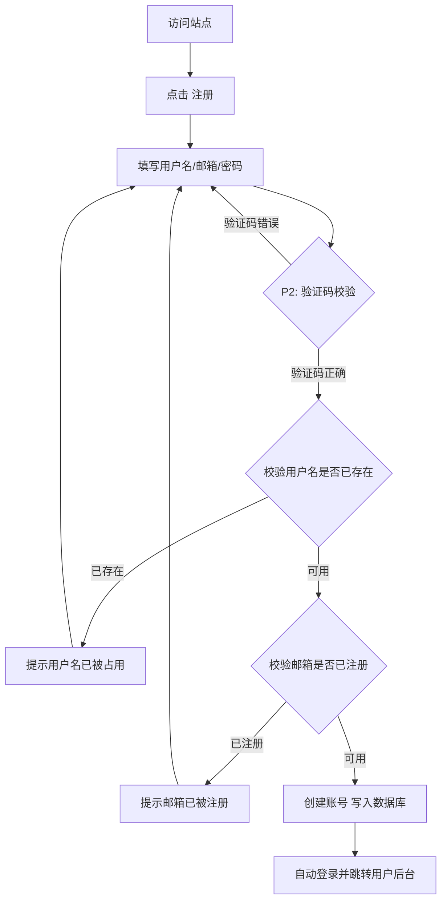
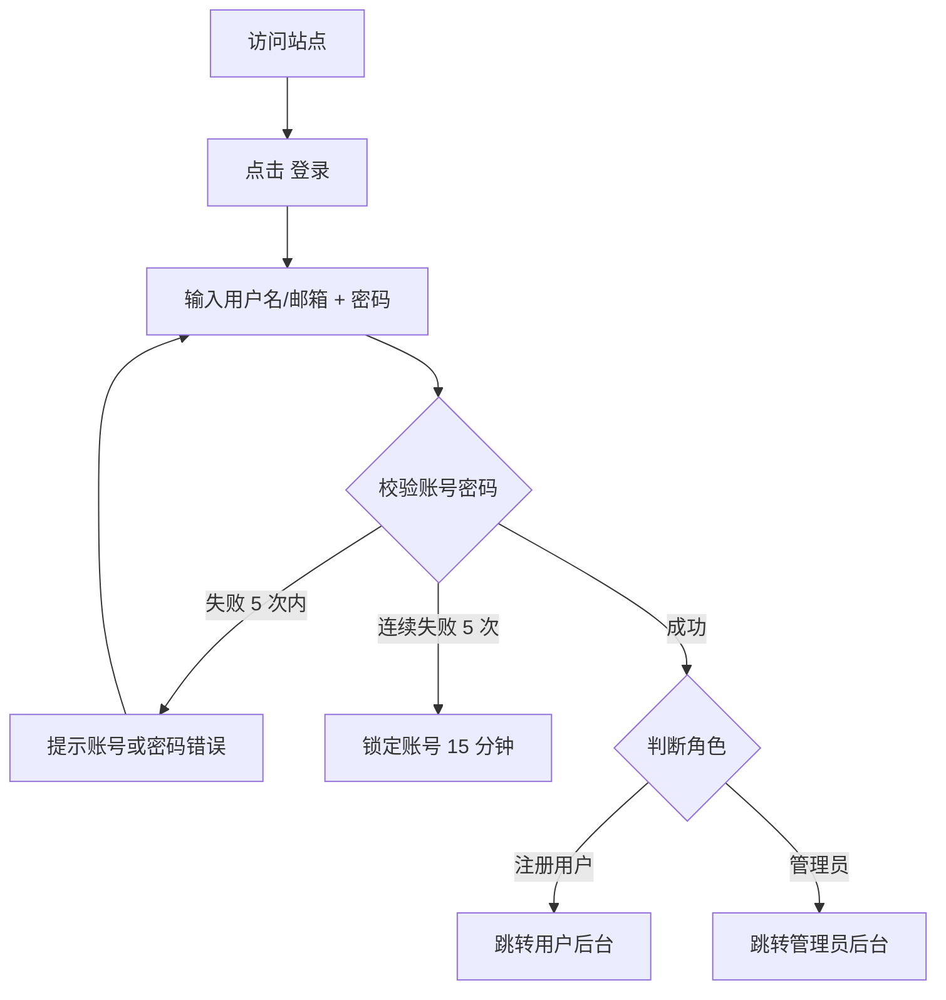
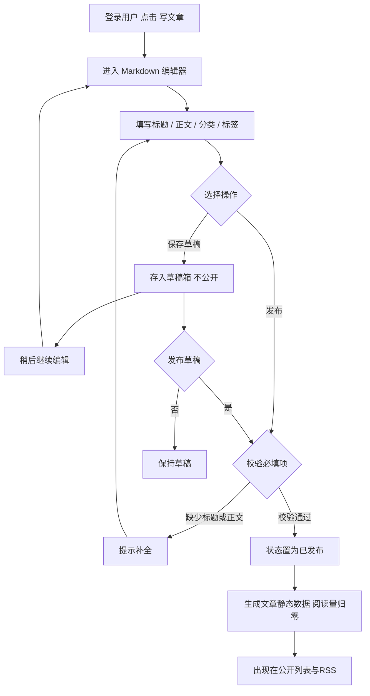
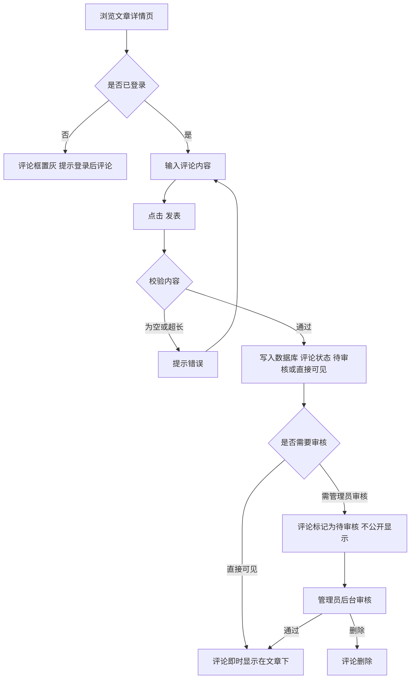
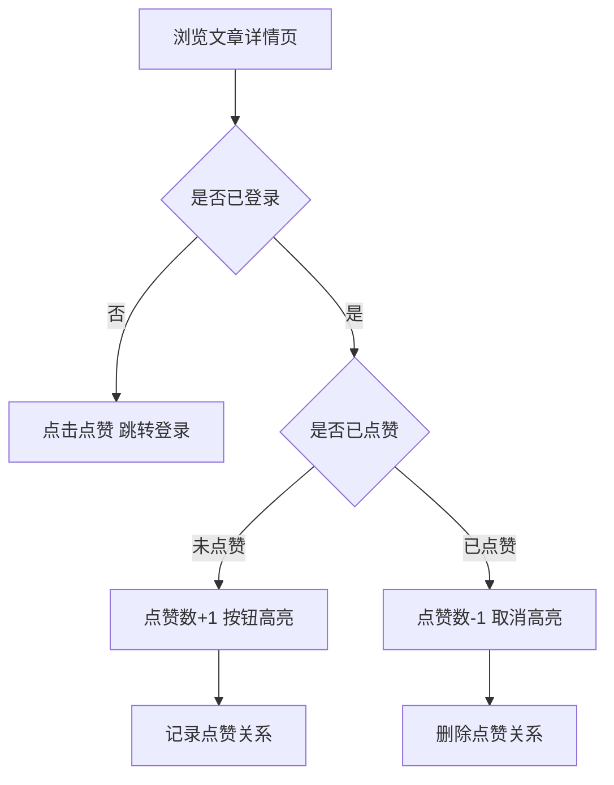
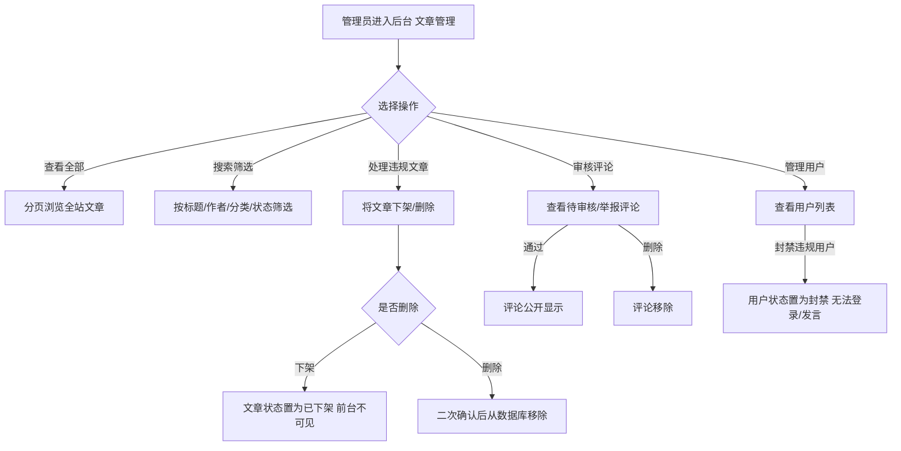
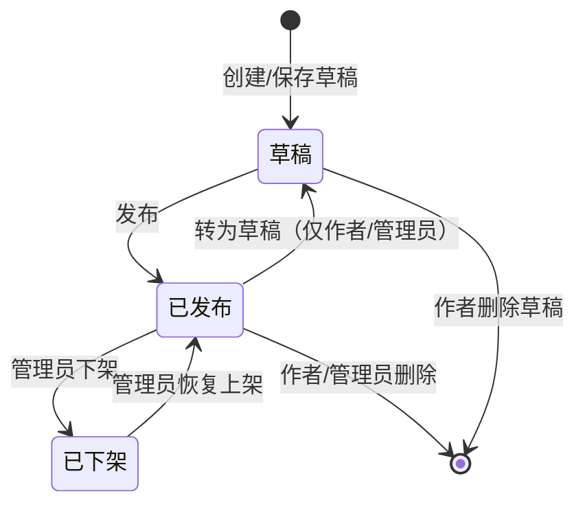

# 个人技术博客系统 产品需求文档（PRD）

| 项目 | 内容 |
|------|------|
| 项目名称 | hdochub 个人技术博客 |
| 文档版本 | V1.0 |
| 域名 | blog.hdochub.com |
| 部署环境 | Ubuntu 服务器 + 宝塔面板 |
| 编写日期 | 2026-07-28 |
| 文档状态 | 评审中 |

---

## 1. 项目概述

### 1.1 项目背景

博主是一名工程师，在日常工作和学习中积累了大量技术问题、解决方案与观点。这些内容散落在各处笔记和文档中，缺乏一个集中、可检索、可分享的承载平台。市面上现有博客平台要么过于静态（如 Hexo，无法支撑评论、点赞等动态交互）、要么过于臃肿（如 WordPress，插件依赖繁重）、要么偏向商业化运营（如 Ghost，强调会员订阅与内容变现），均不完全契合「面向工程师的个人技术博客」这一场景。

本项目计划在博主个人服务器上部署一套自有的博客系统，既满足技术内容写作与分享的核心诉求，又具备多用户协作与社区互动能力，同时通过野兽派（Brutalism）设计风格在视觉上形成鲜明个性。

### 1.2 产品定位

面向工程师的个人技术博客系统，支持多用户注册写作，记录工作生活中的技术问题、解决方案、技术观点和教程。系统兼顾个人表达与社区互动，提供从内容创作、组织管理到读者互动的完整链路。

核心价值主张：

- **写作优先**：Markdown 编辑器 + 代码高亮，匹配工程师的写作习惯
- **社区互动**：评论、回复、点赞，让技术讨论沉淀在文章下
- **内容治理**：三层权限体系 + 后台管理，保障内容质量与秩序
- **检索友好**：分类、标签、搜索、归档多维组织，让旧文可被发现

### 1.3 设计风格

采用野兽派（Brutalism）设计语言，核心理念为「粗犷原始极简，内容至上」：

| 维度 | 设计规范 |
|------|----------|
| 字体 | 系统字体族或等宽字体（如 `ui-monospace`、`SFMono-Regular`、`Menlo`），正文行高 1.6-1.8 |
| 配色 | 黑白为主，高对比度；偶尔撞色（如纯红 `#FF0000`、纯黄 `#FFFF00`）用于强调与交互态 |
| 形状 | 无圆角（`border-radius: 0`）、无阴影（`box-shadow: none`）、无渐变 |
| 布局 | 网格分明，硬边框分隔区域，留白克制但有序 |
| 交互 | Hover 态用反色（黑白翻转）或加粗边框，不使用平滑过渡动画（或仅 0.05s 线性） |
| 内容 | 内容至上，装饰元素最少化，去除一切非功能性视觉噪音 |

### 1.4 竞品调研与借鉴

为取长补短，对四款主流博客平台进行功能调研，结论如下。

#### 1.4.1 调研对象概览

| 平台 | 类型 | 技术栈 | 运行方式 | 数据存储 |
|------|------|--------|----------|----------|
| Hexo | 静态站点生成器（SSG） | Node.js | 生成静态 HTML | 文件系统 |
| Halo | 动态 CMS | Java（Spring Boot） | 服务端常驻 | 关系型数据库 |
| Ghost | 动态 CMS | Node.js | 服务端常驻 | SQLite/MySQL |
| WordPress | 动态 CMS | PHP | 服务端常驻 | MySQL |

#### 1.4.2 各平台功能特点

**Hexo**：以静态文件为核心，写作体验纯粹，部署成本近乎为零（可托管于 GitHub Pages）。支持 GitHub Flavored Markdown，可集成 NPM 包扩展能力。核心局限在于缺乏动态交互能力——评论、会员、点赞等需要服务端处理的功能无法直接实现，必须依赖 Disqus 等第三方服务。适合纯写作、不需互动的博主，但无法满足本项目的多用户注册与社区互动诉求。

**Halo**：Java 生态的动态建站工具，覆盖博客、知识库、企业官网等场景。内置 Web 管理端（halo-admin）和独立评论组件（halo-comment），支持插件化扩展（Java+Vue）。关系型数据库存储，毫秒级响应。2.15 版本起支持文章历史版本查看。其后台管理与插件体系对本项目的用户后台设计有直接借鉴价值。

**Ghost**：定位为「博客 + Newsletter」一体化平台，核心链路围绕「写作 → 发布 → 邮件推送 → 会员付费」展开。原生会员系统（免费/付费分层），内置完整 SEO（XML sitemap、canonical 标签、语义化标记、Twitter Cards），无需插件即可获得搜索引擎友好性。Markdown 沉浸式编辑体验出色。其原生 SEO 与 RSS feed 的实现思路值得直接采纳，会员分层理念启发了本项目的三层权限设计。

**WordPress**：全球最大 CMS 生态，插件与主题极其丰富。代码高亮（Prism/Highlight.js）、目录生成（Easy Table of Contents）、阅读统计（Post Views Counter）等均通过插件实现。核心优势是功能覆盖全面，劣势是插件依赖繁重、易臃肿。本项目将这些「插件级功能」内建为核心模块，避免对外部依赖。

#### 1.4.3 借鉴总结

| 借鉴点 | 来源平台 | 本项目应用 |
|--------|----------|------------|
| Markdown 优先写作、代码高亮 | Hexo / Ghost | 内建 Markdown 编辑器，支持主流语言代码高亮 |
| Web 后台管理 + 独立评论组件 | Halo | 用户后台与管理员后台分离设计 |
| 原生 SEO、RSS feed | Ghost | 内建 RSS feed、语义化 HTML、sitemap |
| TOC、阅读统计、点赞 | WordPress 插件生态 | 内建为核心功能，不依赖外部插件 |
| 多用户注册与权限分层 | Ghost 会员系统 + Halo 角色 | 三层权限体系（游客/注册用户/管理员） |
| 文章版本历史 | Halo 2.15 | 草稿箱 + 修订记录 |

### 1.5 项目目标

本项目为 0-to-1 新建产品，目标如下：

- 上线后博主可顺畅完成「写作 → 发布 → 分享」全流程，单篇文章从创建到发布不超过 5 分钟
- 注册用户可独立管理自己的文章与评论，无需管理员介入
- 游客无需注册即可浏览全部已发布文章，搜索响应不超过 1 秒
- 管理员可对全站内容、用户、分类标签进行治理，违规内容可在 30 秒内处理

---

## 2. 用户画像

### 2.1 游客（未登录读者）

| 属性 | 描述 |
|------|------|
| 身份 | 通过搜索引擎、友链、社交媒体链接访问站点的匿名读者 |
| 使用频率 | 偶发性访问，多为「搜索到某篇技术文章」后进入 |
| 核心诉求 | 快速找到解决方案、阅读代码示例、复制代码片段 |
| 痛点 | 想搜索特定问题、想看相关文章但不愿注册账号 |
| 行为特征 | 只读为主，停留时间取决于文章质量；可能通过 RSS 订阅持续关注 |

### 2.2 注册用户（作者）

| 属性 | 描述 |
|------|------|
| 身份 | 注册了账号的工程师读者，部分会转化为内容贡献者 |
| 使用频率 | 每周 1-3 次访问，写作时集中使用 |
| 核心诉求 | 写技术笔记并发布、参与评论讨论、收藏与点赞有价值的文章 |
| 痛点 | 写到一半要保存草稿、想管理自己文章的阅读数据、评论被回复时希望收到通知 |
| 行为特征 | 重视写作体验（Markdown）、关注自己文章的阅读量与互动、有自己的小后台管理内容 |

### 2.3 管理员（博主/站长）

| 属性 | 描述 |
|------|------|
| 身份 | 默认一位超级管理员（博主本人），可创建其他管理员 |
| 使用频率 | 每日或每两日访问后台 |
| 核心诉求 | 管理全站内容质量、维护分类与标签体系、处理违规评论与垃圾注册、配置站点设置 |
| 痛点 | 需要批量管理内容、审核评论、处理垃圾注册、查看全站数据概览 |
| 行为特征 | 通过后台高效治理站点，偶尔也在前台写作 |

---

## 3. 功能清单与优先级

### 3.1 优先级定义

| 优先级 | 含义 | 上线要求 |
|--------|------|----------|
| P0 | 核心功能，缺则产品不成立 | 必须在 V1.0 上线 |
| P1 | 重要功能，显著提升核心体验 | 应在 V1.0 上线，可延至 V1.1 |
| P2 | 增强功能，锦上添花 | 可在 V1.1 及以后迭代 |

### 3.2 P0 核心功能

| 编号 | 功能模块 | 功能描述 |
|------|----------|----------|
| F-P0-01 | 文章浏览 | 游客无需登录即可浏览文章列表（分页）和文章详情，列表按发布时间倒序排列 |
| F-P0-02 | 注册登录 | 账号密码方式注册与登录，注册时需填写用户名、邮箱、密码；登录后保持会话 |
| F-P0-03 | Markdown 编辑器 | 富文本/Markdown 编辑器，支持代码块语法高亮（覆盖 20+ 主流编程语言），支持实时预览 |
| F-P0-04 | 发表文章 | 登录用户可创建文章，填写标题、正文、分类、标签后发布；正文支持 Markdown |
| F-P0-05 | 编辑/删除文章 | 用户可编辑、删除自己的文章；删除需二次确认 |
| F-P0-06 | 文章分类 | 文章归属一个分类（如：技术问题、教程、观点、随笔），分类由管理员维护 |
| F-P0-07 | 文章标签 | 文章可打多个标签，标签由用户发布时自由创建或选用已有 |
| F-P0-08 | 搜索 | 支持按关键词搜索文章标题与正文，搜索结果高亮匹配词 |
| F-P0-09 | 评论 | 文章详情页支持评论，需登录后才能发表评论 |
| F-P0-10 | 用户后台 | 注册用户有独立小后台，管理自己的文章（列表、状态、编辑、删除）和评论 |
| F-P0-11 | 管理员后台 | 管理员有全站后台，管理文章、分类、标签、评论、用户 |
| F-P0-12 | 权限体系 | 三层权限：游客/注册用户/管理员，各角色可操作范围严格隔离 |

### 3.3 P1 重要功能

| 编号 | 功能模块 | 功能描述 |
|------|----------|----------|
| F-P1-01 | 文章草稿箱 | 写作过程中可保存草稿，草稿不公开；支持草稿与已发布之间切换 |
| F-P1-02 | 文章封面图 | 每篇文章可上传或设置封面图，展示在列表与详情页顶部 |
| F-P1-03 | 文章目录（TOC） | 长文章根据 Markdown 标题层级自动生成侧边目录，支持点击锚点跳转 |
| F-P1-04 | 阅读量统计 | 记录每篇文章被阅读次数，展示在文章详情页与列表；去重统计（同一 IP 短时间内多次访问计一次） |
| F-P1-05 | 点赞功能 | 登录用户可给文章点赞，每用户每篇仅可赞一次，可取消；展示总点赞数 |
| F-P1-06 | 评论回复 | 可回复别人的评论，形成楼中楼嵌套结构（最多 3 层） |
| F-P1-07 | 文章归档 | 按年月时间线归档展示全部文章，支持折叠展开 |
| F-P1-08 | 文章排序 | 列表支持按时间倒序、按阅读量排序；支持按分类、按标签筛选 |
| F-P1-09 | 用户头像 | 注册用户可上传头像，展示在评论与用户主页 |
| F-P1-10 | 管理员审核评论 | 管理员可删除违规评论、屏蔽违规用户 |

### 3.4 P2 增强功能

| 编号 | 功能模块 | 功能描述 |
|------|----------|----------|
| F-P2-01 | 关于页面 | 介绍博主/网站的静态页面，内容由管理员编辑 |
| F-P2-02 | 友链页面 | 展示友情链接，管理员可增删友链 |
| F-P2-03 | RSS 订阅 | 提供全站 RSS feed，支持按分类订阅 |
| F-P2-04 | 防垃圾注册 | 注册时加图形验证码，限制同 IP 注册频率 |
| F-P2-05 | 创建管理员 | 超级管理员可创建其他管理员账号，并指定权限范围 |
| F-P2-06 | 站点设置 | 管理员可配置站点标题、副标题、描述、备案号等基本信息 |

### 3.5 功能总表

| 优先级 | 数量 | 上线版本 |
|--------|------|----------|
| P0 核心 | 12 项 | V1.0 |
| P1 重要 | 10 项 | V1.0（主）/ V1.1 |
| P2 增强 | 6 项 | V1.1 及以后 |

---

## 4. 用户流程

### 4.1 注册与登录流程

#### 4.1.1 注册流程



注册业务规则：

- 用户名长度 3-20 字符，仅允许字母、数字、下划线
- 邮箱格式校验，需真实有效（V1.0 不强制邮箱验证，V1.1 可加邮件激活）
- 密码长度 8-32 字符，至少包含字母与数字
- 同一 IP 24 小时内注册不超过 5 次（防垃圾注册，P2）
- 新注册用户默认角色为「注册用户」，无管理员权限

#### 4.1.2 登录流程



登录业务规则：

- 登录方式支持用户名或邮箱任一
- 连续登录失败 5 次锁定账号 15 分钟，锁定期间不可登录
- 登录成功后生成会话 Token，有效期 7 天，支持「记住我」延长至 30 天

### 4.2 发表文章流程



发表文章业务规则：

- 标题必填，1-100 字符
- 正文必填，最少 10 字符
- 分类必选一个（由管理员预设）
- 标签可选，每篇最多 10 个，每个标签 2-20 字符
- 封面图可选（P1），支持上传图片或填写外链 URL
- 草稿不公开、不出现在列表、不计入阅读量、不进入 RSS
- 发布后可再次编辑；编辑已发布文章会更新内容，发布时间不变，可选记录修订历史

### 4.3 评论流程



评论业务规则：

- 评论需登录后才能发表
- 评论内容 1-500 字符，支持基础 Markdown（加粗、代码、链接）
- 评论默认直接可见（V1.0），管理员可在站点设置中开启「评论需审核」开关（V1.1）
- 楼中楼回复最多嵌套 3 层，超过 3 层在第 3 层平铺显示
- 评论者可删除自己的评论；管理员可删除任意评论
- 被删除的评论不展示，其下的回复保留但显示「该评论已删除」

### 4.4 点赞流程



点赞业务规则：

- 仅登录用户可点赞，每用户每篇文章仅可赞一次
- 点赞可取消，取消后可再次点赞
- 文章列表与详情页均展示总点赞数

### 4.5 文章审核与管理流程（管理员视角）



管理员管理业务规则：

- 管理员可管理全站所有用户的所有文章，不限于自己
- 文章下架后前台不可见，作者后台仍可见并标注「已下架」状态
- 文章删除为硬删除（从数据库移除），删除前必须二次确认
- 用户封禁后该用户无法登录、无法发言，但其历史文章保留（可由管理员决定是否一并下架）

---

## 5. 页面清单与功能说明

页面分为三大区域：前台公开页面（游客可见）、用户后台（登录用户）、管理员后台（管理员）。

### 5.1 前台公开页面

#### 5.1.1 首页

| 区域 | 说明 |
|------|------|
| 顶部导航 | 站点标题（左）、导航菜单（首页/分类/标签/归档/关于/友链）、登录/注册按钮或用户头像（右） |
| 文章列表 | 文章卡片流，每张卡片展示：封面图（P1）、标题、摘要（正文前 200 字）、分类、标签、作者、发布时间、阅读量、点赞数 |
| 排序与筛选 | 列表顶部提供排序切换：按时间倒序（默认）/ 按阅读量；提供分类与标签快捷筛选入口 |
| 分页 | 底部分页导航，每页 10 篇 |
| 侧边栏（可选） | 搜索框、分类列表、热门标签云、热门文章 Top5（按阅读量） |

#### 5.1.2 文章详情页

| 区域 | 说明 |
|------|------|
| 文章头部 | 封面图（P1）、标题、分类、标签、作者头像与名称、发布时间、阅读量、字数、预计阅读时长 |
| 正文 | Markdown 渲染后的 HTML，代码块语法高亮，图片自适应宽度 |
| 文章目录（TOC） | 侧边栏固定展示，根据 H2/H3 层级自动生成，点击锚点平滑跳转，当前阅读位置高亮 |
| 点赞区 | 正文底部点赞按钮，展示总点赞数；未登录点击跳转登录 |
| 评论区 | 评论列表（按时间正序）+ 评论输入框；楼中楼嵌套回复；评论者头像与昵称、时间、内容 |
| 文章底部 | 上一篇/下一篇导航、相关文章推荐（同分类或同标签） |
| 页脚 | 版权信息、备案号、RSS 链接 |

#### 5.1.3 分类页

| 区域 | 说明 |
|------|------|
| 分类导航 | 展示所有分类及其文章数量 |
| 分类下文章 | 点击某分类后，展示该分类下的文章列表，复用首页文章卡片样式 |
| 筛选 | 支持在分类下进一步按标签筛选 |

#### 5.1.4 标签页

| 区域 | 说明 |
|------|------|
| 标签云 | 所有标签按文章数量大小排列，字号反映热度 |
| 标签下文章 | 点击某标签后，展示包含该标签的文章列表 |

#### 5.1.5 归档页

| 区域 | 说明 |
|------|------|
| 时间线 | 按年份分组，年份下按月份分组，展示该月发布的文章标题与日期 |
| 折叠展开 | 每个年份可折叠/展开，默认展开最近一年 |

#### 5.1.6 搜索结果页

| 区域 | 说明 |
|------|------|
| 搜索框 | 顶部保留搜索框，显示当前关键词 |
| 结果列表 | 匹配的文章卡片，标题与摘要中匹配关键词高亮 |
| 无结果态 | 未匹配到时展示空状态提示，建议尝试其他关键词或浏览分类 |

#### 5.1.7 关于页面

展示博主/网站介绍内容，由管理员在后台编辑，支持 Markdown 渲染。

#### 5.1.8 友链页面

展示友情链接列表，每条包含：站点名称、URL、简介、Logo（可选）。管理员在后台增删。

#### 5.1.9 注册页

| 字段 | 类型 | 必填 | 校验规则 |
|------|------|------|----------|
| 用户名 | 文本 | 是 | 3-20 字符，字母数字下划线，唯一 |
| 邮箱 | 文本 | 是 | 合法邮箱格式，唯一 |
| 密码 | 密码 | 是 | 8-32 字符，含字母与数字 |
| 确认密码 | 密码 | 是 | 与密码一致 |
| 验证码（P2） | 图形验证码 | 是 | 不区分大小写 |

#### 5.1.10 登录页

| 字段 | 类型 | 必填 | 说明 |
|------|------|------|------|
| 用户名/邮箱 | 文本 | 是 | 支持用户名或邮箱登录 |
| 密码 | 密码 | 是 | - |
| 记住我 | 勾选 | 否 | 勾选后会话延长至 30 天 |

### 5.2 用户后台页面

用户后台为登录用户管理个人内容的空间，访问路径 `/dashboard`。

#### 5.2.1 概览页

| 区域 | 说明 |
|------|------|
| 数据统计 | 我的文章总数、总阅读量、总点赞数、评论数 |
| 快捷操作 | 写文章、管理文章、管理评论、编辑资料 |

#### 5.2.2 文章管理页

| 区域 | 说明 |
|------|------|
| 文章列表 | 表格展示：标题、分类、状态（已发布/草稿/已下架）、阅读量、点赞数、发布时间、操作 |
| 操作 | 编辑、删除（二次确认）、设为草稿/发布 |
| 筛选 | 按状态筛选（全部/已发布/草稿/已下架） |
| 分页 | 每页 20 条 |

#### 5.2.3 写文章/编辑文章页

| 区域 | 说明 |
|------|------|
| 标题输入 | 顶部大字号标题输入框 |
| Markdown 编辑器 | 左侧编辑区 + 右侧实时预览区，支持分屏与全屏切换 |
| 工具栏 | 加粗、斜体、标题、列表、代码块、引用、链接、图片、表格等快捷按钮 |
| 元信息区 | 分类下拉（必选）、标签输入（多选，支持自动补全已有标签）、封面图上传（P1）、摘要输入（可选，自动取正文前 200 字） |
| 操作按钮 | 保存草稿、发布、预览（新开标签页渲染预览） |

#### 5.2.4 评论管理页

| 区域 | 说明 |
|------|------|
| 评论列表 | 展示该用户收到的所有评论与回复（他人对自己文章的评论），表格含：文章标题、评论者、内容、时间 |
| 操作 | 查看原评论上下文、删除（仅限自己在他人文章下的评论） |

#### 5.2.5 个人资料页

| 字段 | 类型 | 说明 |
|------|------|------|
| 头像（P1） | 图片上传 | 支持上传或填写外链，默认使用首字母方块头像 |
| 昵称 | 文本 | 显示在评论与文章作者位，1-20 字符 |
| 个人简介 | 文本域 | 展示在用户主页，最多 200 字符 |
| 修改密码 | 密码 | 需验证原密码后设置新密码 |

### 5.3 管理员后台页面

管理员后台为站长治理全站的空间，访问路径 `/admin`。仅管理员可访问。

#### 5.3.1 管理概览页

| 区域 | 说明 |
|------|------|
| 全站统计 | 文章总数、用户总数、评论总数、今日阅读量、今日新增用户 |
| 待办提醒 | 待审核评论数、举报文章数、新注册用户数 |
| 快捷入口 | 文章管理、用户管理、评论管理、分类管理、标签管理、站点设置 |

#### 5.3.2 文章管理页

| 区域 | 说明 |
|------|------|
| 文章列表 | 全站文章表格：标题、作者、分类、状态、阅读量、点赞数、评论数、发布时间、操作 |
| 操作 | 编辑、下架、删除（二次确认）、恢复上架 |
| 筛选 | 按作者、分类、状态、时间范围筛选 |
| 搜索 | 按标题搜索 |
| 批量操作 | 批量下架、批量删除 |

#### 5.3.3 分类管理页

| 区域 | 说明 |
|------|------|
| 分类列表 | 表格：分类名称、文章数量、排序、创建时间、操作 |
| 操作 | 新增分类、编辑名称、删除（分类下有文章时不可删除，需先迁移文章）、调整排序 |

#### 5.3.4 标签管理页

| 区域 | 说明 |
|------|------|
| 标签列表 | 表格：标签名称、关联文章数、创建时间、操作 |
| 操作 | 编辑标签名、合并标签、删除（删除后从关联文章移除该标签） |
| 搜索 | 按标签名搜索 |

#### 5.3.5 评论管理页

| 区域 | 说明 |
|------|------|
| 评论列表 | 全站评论表格：文章标题、评论者、内容、回复对象、时间、状态、操作 |
| 操作 | 通过审核（若开启审核）、删除评论、屏蔽评论者 |
| 筛选 | 按状态（待审核/已通过/已删除）、按文章、按时间筛选 |

#### 5.3.6 用户管理页

| 区域 | 说明 |
|------|------|
| 用户列表 | 表格：用户名、邮箱、角色、文章数、评论数、注册时间、状态、操作 |
| 操作 | 编辑角色（升级为管理员/降级）、封禁/解封用户、重置密码 |
| 筛选 | 按角色、状态筛选 |
| 创建管理员（P2） | 创建管理员账号，指定权限范围 |

#### 5.3.7 站点设置页（P2）

| 字段 | 类型 | 说明 |
|------|------|------|
| 站点标题 | 文本 | 全站标题 |
| 站点副标题 | 文本 | 副标题/描述 |
| 站点描述 | 文本域 | SEO meta description |
| 备案号 | 文本 | 页脚展示 |
| 评论审核开关 | 开关 | 开启后评论需管理员审核才公开 |
| 注册开关 | 开关 | 关闭后不允许新用户注册 |
| 每页文章数 | 数字 | 列表分页大小，默认 10 |

---

## 6. 权限体系

### 6.1 角色定义

系统采用三层角色体系，角色具有继承关系：管理员 ⊃ 注册用户 ⊃ 游客。

| 角色 | 标识 | 说明 | 获取方式 |
|------|------|------|----------|
| 游客 | `GUEST` | 未登录的匿名访客，只读权限 | 默认 |
| 注册用户 | `USER` | 已注册并登录的普通用户 | 注册 |
| 管理员 | `ADMIN` | 站点管理者，含超级管理员与普通管理员 | 超级管理员默认一位，由系统初始化创建；普通管理员由超级管理员创建（P2） |

管理员可细分为：

- **超级管理员**：拥有全部权限，可创建/删除其他管理员，可修改站点设置，不可被降级或封禁
- **普通管理员（P2）**：由超级管理员创建，拥有内容管理权限，但不可管理管理员账号与站点核心设置

### 6.2 权限矩阵

| 操作 | 游客 | 注册用户 | 管理员 |
|------|------|----------|--------|
| 浏览文章列表 | 是 | 是 | 是 |
| 浏览文章详情 | 是 | 是 | 是 |
| 搜索文章 | 是 | 是 | 是 |
| 按分类/标签筛选 | 是 | 是 | 是 |
| 查看归档/关于/友链 | 是 | 是 | 是 |
| RSS 订阅 | 是 | 是 | 是 |
| 注册账号 | 是 | - | - |
| 登录 | - | 是 | 是 |
| 发表文章 | - | 是（仅自己） | 是（全部） |
| 编辑文章 | - | 是（仅自己） | 是（全部） |
| 删除文章 | - | 是（仅自己） | 是（全部） |
| 下架/恢复文章 | - | 否 | 是 |
| 发表评论 | - | 是 | 是 |
| 回复评论 | - | 是 | 是 |
| 删除评论 | - | 是（仅自己） | 是（全部） |
| 审核评论 | - | 否 | 是 |
| 点赞文章 | - | 是 | 是 |
| 用户后台 | - | 是（自己的数据） | 是（全站数据） |
| 管理分类/标签 | - | 否 | 是 |
| 管理用户 | - | 否 | 是 |
| 创建管理员 | - | 否 | 仅超级管理员 |
| 站点设置 | - | 否 | 仅超级管理员 |
| 编辑关于/友链页面 | - | 否 | 是 |

### 6.3 权限校验规则

1. **前端控制**：根据用户角色显示/隐藏对应入口与按钮，未授权操作不展示
2. **后端校验**：所有写操作（发表、编辑、删除、评论、点赞）必须在服务端二次校验用户身份与数据归属，前端隐藏仅做体验优化，不作为安全边界
3. **数据隔离**：注册用户查询文章、评论时，接口强制附加 `user_id = 当前用户` 条件，防止越权访问他人数据
4. **管理员校验**：访问 `/admin` 路径及管理接口时校验角色为 `ADMIN`，普通管理员访问超管功能返回 403
5. **资源归属判断**：编辑/删除文章时，先查询文章 `author_id`，若与当前用户 ID 不一致且当前用户非管理员，返回 403

---

## 7. 信息架构

### 7.1 分类体系建议

分类是文章的一级归属，每篇文章归属且仅归属一个分类。分类由管理员维护，数量控制在 4-8 个为宜。

建议初始分类：

| 分类 | 定位 | 适用内容示例 |
|------|------|--------------|
| 技术问题 | 记录工作/学习中遇到的技术问题及解决方案 | 「Nginx 502 排查记录」「Docker 容器无法启动的解决过程」 |
| 教程 | 系统性的技术教程与操作指南 | 「从零搭建 CI/CD 流水线」「Git Rebase 实操指南」 |
| 观点 | 技术观点、行业思考、架构选型讨论 | 「为什么我选择 PostgreSQL」「微服务不是银弹」 |
| 随笔 | 非纯技术的工作生活记录 | 「一次线上事故复盘」「工程师的成长焦虑」 |

分类设计原则：

- 分类名简洁明确，2-4 字为佳
- 分类之间互斥，一篇文章归入最贴切的分类
- 分类数量不宜过多，避免选择困难；如需更细维度，用标签补充

### 7.2 标签体系建议

标签是文章的多维标记，每篇文章可打多个标签。标签由用户在发布时自由创建或选用已有，无需管理员预审。

标签设计原则：

- 标签面向具体技术点或主题词，如 `Docker`、`Nginx`、`性能优化`、`Linux`
- 标签更细粒度，与分类互补：分类管「这篇文章是什么类型」，标签管「这篇文章涉及什么技术」
- 鼓励复用已有标签，发布时输入框做自动补全，提示已有标签避免同义词重复（如 `Docker` 与 `docker`）
- 标签管理页提供合并功能，管理员可将同义标签合并（P1）

标签与分类的关系示例：

```
分类：技术问题
标签：Docker, Nginx, 网络
```

文章通过「分类 + 标签」双重维度被检索：分类做大范围归类，标签做精准关联检索。

### 7.3 内容状态流转

文章存在多种状态，状态间转换如下：



| 状态 | 前台可见 | 列表展示 | RSS | 计阅读量 | 计点赞 |
|------|----------|----------|-----|----------|--------|
| 已发布 | 是 | 是 | 是 | 是 | 是 |
| 草稿 | 否 | 否 | 否 | 否 | 否 |
| 已下架 | 否 | 否 | 否 | 否 | 冻结现有数据 |
| 已删除 | - | - | - | - | - |

---

## 8. 非功能需求

### 8.1 性能需求

| 指标 | 目标值 |
|------|--------|
| 首页加载时间 | 首屏渲染 ≤ 1.5s（3G 模拟环境下） |
| 文章详情页加载 | ≤ 1s（已发布文章，不含图片） |
| 搜索响应 | ≤ 1s（关键词匹配，文章数 1000 篇以内） |
| 接口响应时间 | 普通查询 ≤ 200ms，列表分页 ≤ 500ms |
| 并发承载 | 支持 100 并发用户正常访问不降级 |
| 图片加载 | 封面图压缩至 200KB 以内，列表懒加载 |
| 数据库查询 | 单次查询扫描行数 ≤ 10000，列表查询走索引 |

性能保障措施：

- 文章列表与详情页支持服务端缓存（缓存有效期 5 分钟，发布/编辑文章时失效）
- 图片上传时自动压缩并生成缩略图
- 文章列表与分页使用数据库索引（发布时间倒序索引、分类索引、标签关联索引）
- 静态资源（CSS/JS/图片）通过宝塔面板配置 Nginx 缓存与 Gzip 压缩

### 8.2 安全需求

| 类别 | 要求 |
|------|------|
| 密码存储 | 密码使用 bcrypt 加盐哈希存储，禁止明文存储或可逆加密 |
| 会话管理 | 使用 JWT 或服务端 Session，Token 有效期 7 天；敏感操作（改密码、删文章）需重新验证 |
| SQL 注入防护 | 全部使用参数化查询 / ORM，禁止拼接 SQL |
| XSS 防护 | 用户输入内容（文章正文、评论）渲染前做 HTML 转义；Markdown 渲染时过滤危险标签（script、iframe 等） |
| CSRF 防护 | 写操作接口校验 CSRF Token 或使用 SameSite Cookie |
| 接口限流 | 登录接口 5 次/分钟、注册接口 3 次/小时、评论接口 10 次/分钟，按 IP 限流 |
| 文件上传安全 | 图片上传校验 MIME 类型与文件头，限制格式为 jpg/png/gif/webp；限制单文件 5MB；上传目录禁止执行权限 |
| HTTPS | 全站强制 HTTPS，通过宝塔面板配置 Let's Encrypt 证书并自动续签 |
| 敏感信息 | 配置文件中的数据库密码、密钥不入版本库，通过环境变量注入 |
| 后台路径 | 管理员后台路径 `/admin` 可在站点设置中自定义修改，避免默认路径被扫描 |

### 8.3 兼容性需求

| 维度 | 要求 |
|------|------|
| 浏览器兼容 | Chrome 90+、Firefox 88+、Safari 14+、Edge 90+；不支持 IE |
| 移动端适配 | 响应式设计，适配 375px 及以上屏幕宽度；移动端导航折叠为汉堡菜单 |
| Markdown 兼容 | 支持 GitHub Flavored Markdown 规范，包含表格、任务列表、代码块、删除线、自动链接 |
| 代码高亮 | 覆盖主流语言：JavaScript、TypeScript、Python、Java、Go、Rust、C/C++、Shell/Bash、SQL、JSON、YAML、HTML、CSS、PHP、Ruby、Kotlin、Swift 等不少于 20 种 |
| RSS 兼容 | 输出符合 RSS 2.0 规范的 XML，可在主流阅读器（Feedly、Inoreader 等）正常订阅 |
| 数据库兼容 | 部署环境为 Ubuntu + 宝塔面板，数据库兼容 MySQL 5.7+ / MariaDB 10.3+ |

### 8.4 部署与运维需求

| 维度 | 要求 |
|------|------|
| 运行环境 | Ubuntu 系统，已安装宝塔面板，通过宝塔管理 Nginx、数据库、SSL 证书 |
| 部署方式 | 支持 Docker 容器部署或宝塔面板直接部署，提供部署文档 |
| 数据备份 | 数据库每日自动备份（宝塔计划任务），保留最近 7 天；上传图片目录同步备份 |
| 日志 | 记录访问日志与错误日志，日志按天切割保留 30 天 |
| 监控 | 宝塔面板内置资源监控（CPU/内存/磁盘/带宽），异常时告警 |
| 域名 | 绑定 blog.hdochub.com，配置 HTTPS |

### 8.5 SEO 需求

| 要求 | 说明 |
|------|------|
| 语义化 HTML | 使用 article、header、nav、section 等语义标签 |
| Meta 标签 | 每篇文章生成独立的 title、description、og 标签 |
| URL 结构 | 文章 URL 使用语义化 slug（如 `/post/docker-502-fix`），不使用纯 ID |
| Sitemap | 自动生成 sitemap.xml 并提交搜索引擎 |
| 站点 robots | 配置 robots.txt，允许爬虫抓取公开内容，禁止抓取后台路径 |

---
